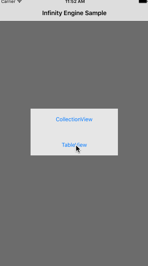
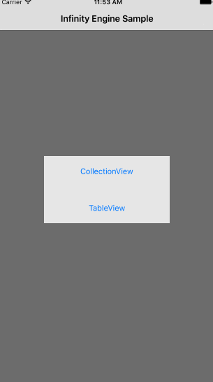

# InfinityEngine

[](https://travis-ci.org/RyanHWillis/InfinityEngine)
[](http://cocoapods.org/pods/InfinityEngine)
[](http://cocoapods.org/pods/InfinityEngine)
[](http://cocoapods.org/pods/InfinityEngine)

### UITableView & UICollectionView



## Features
+ Elegant TableView & CollectionView paged data handling
+ Progressive Protocol Implemtation
+ Fully customisable Modifers that alter Table/CollectionView behavior
+ Placeholders for pre-data responses
+ Automatic paged loading indicator

## Requirements
+ iOS 8.0 +
+ Xcode 7.3 +

## Example

To run the example project, clone the repo, and run `pod install` from the Example directory first.

## Installation

InfinityEngine is available through [CocoaPods](http://cocoapods.org). To install
it, simply add the following line to your Podfile:

```ruby
pod "InfinityEngine"
```

## Author

RyanHWillis, ryan_h_willis@hotmail.com

## License

InfinityEngine is available under the MIT license. See the LICENSE file for more info.
